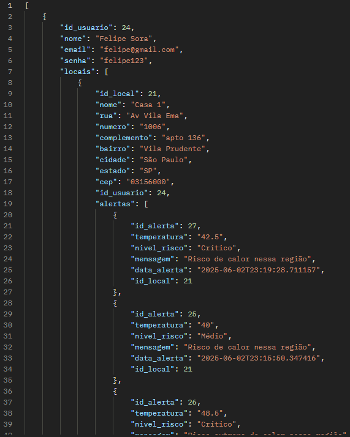
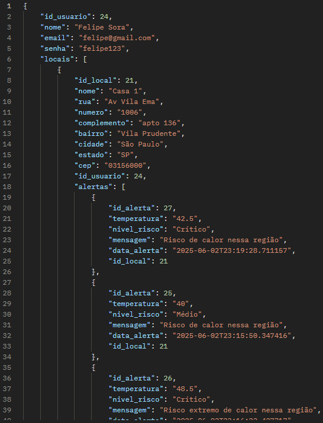
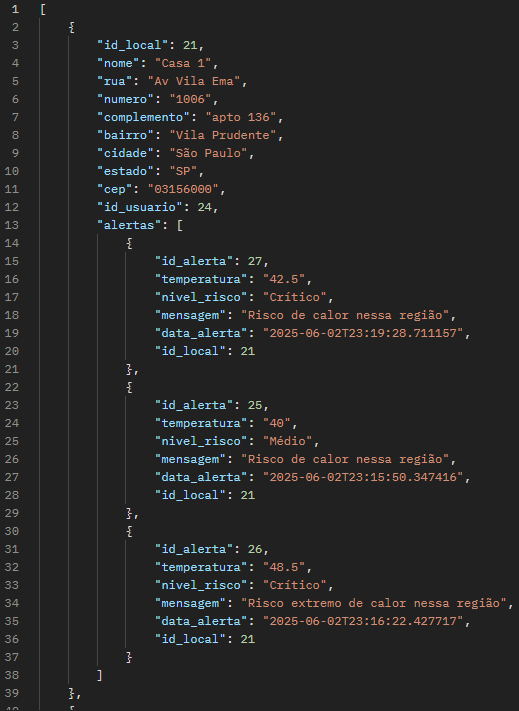
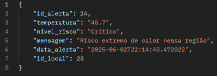
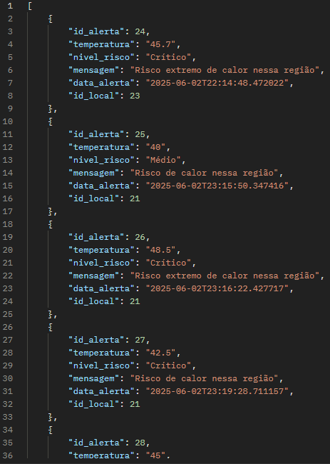
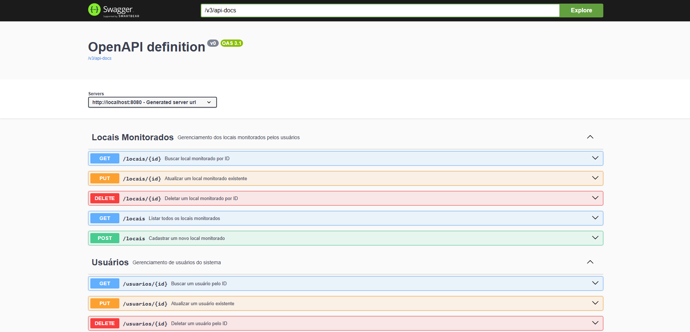
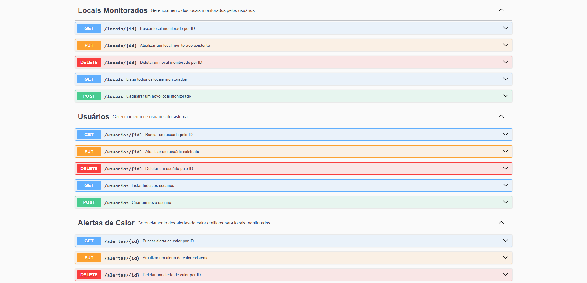

# 🔥 SafeHeat - Backend Java

[](https://github.com/felipesora/safeheat-backend-java)

>API desenvolvida para o projeto SafeHeat, com o objetivo de ajudar pessoas a se protegerem de eventos climáticos extremos,
> especialmente ondas de calor.

## 📝 Descrição do Projeto

**SafeHeat** é uma API desenvolvida para monitorar e alertar usuários sobre eventos de calor extremo em locais previamente cadastrados. A solução visa contribuir com a prevenção de riscos à saúde, especialmente em um cenário de mudanças climáticas severas, oferecendo informações atualizadas e organização dos locais mais vulneráveis.

Este projeto foi desenvolvido como parte do desafio interdisciplinar "**Protech the Future**" da FIAP, que propõe soluções tecnológicas inovadoras para enfrentar problemas causados por eventos extremos da natureza.
Com a API desenvolvida em Java, é possível:

---

## 🚀 Funcionalidades da API

- ✅ Cadastro e gerenciamento de usuários
- ✅ Cadastro de locais monitorados
- ✅ Registro e consulta de alertas de calor- Associar um **status atual** à moto (ex: Em análise, Em manutenção, Disponível).
- ✅ Associação entre usuários, locais e alertas
- ✅ Atualização e exclusão de registros

---

## 👥 Integrantes

- **Felipe Ulson Sora** – RM555462 – [@felipesora](https://github.com/felipesora)
- **Augusto Lope Lyra** – RM558209 – [@lopeslyra10](https://github.com/lopeslyra10)
- **Vinicius Ribeiro Nery Costa** – RM559165 – [@ViniciusRibeiroNery](https://github.com/ViniciusRibeiroNery)

---
## 🛠️ Tecnologias Utilizadas
- Java 21
- Spring Boot 3.4.4
- Maven
- Banco de dados Oracle
- JPA (Hibernate)
- Validação com Jakarta Bean Validation
- Documentação com Springdoc OpenAPI (Swagger)
- RESTful APIs

---


## 🔄 Relação entre os Endpoints

Abaixo estão as relações entre os recursos da API (`Usuário`, `Local Monitorado` e `Alerta de Calor`), detalhando como os dados se conectam entre os endpoints.

### 📘 Diagrama de Relacionamento

```bash
[Usuário]
   │
   └──▶ (1:N) ─── [Local Monitorado]
                       │
                       └──▶ (1:N) ─── [Alerta de Calor]
```
### 📌 Relações Explicadas

- **Usuário ↔ Local Monitorado**
  - Cada local monitorado pertence a um único usuário (`id_usuario`).
  - Um usuário pode possuir **vários locais** monitorados.
  - No endpoint `POST /locais`, é obrigatório informar o `id_usuario`.


- **Local Monitorado ↔ Alerta de Calor**
  - Cada alerta está vinculado a um único local monitorado (`id_local`).
  - Um local pode ter **múltiplos alertas** de calor registrados.
  - No endpoint `POST /alertas`, é obrigatório informar o `id_local`.

### 🔗 Exemplo de Fluxo de Dados

1. `POST /usuarios` – Cria o usuário.
2. `POST /locais` – Cria um local vinculado ao `id_usuario` criado anteriormente.
3. `POST /alertas` – Cria um alerta vinculado ao `id_local` do local criado.

---

## 📡 Endpoints da API

Abaixo estão listados os principais endpoints da API do **SafeHeat**, divididos por entidade. Nos endpoints que requerem envio de dados (POST/PUT), são fornecidos exemplos de JSON.

---

### 👤 Usuário

- `📬 POST - /usuarios`  
  Cadastra um novo usuário.

```jsonc
{
  "nome": "João Silva",
  "email": "joao@example.com",
  "senha": "123456"
}
```

- `📄 GET - /usuarios`  
  Lista todas os usuários cadastrados, com seus locais e alertas cadastrados.



- `🔍 GET BY ID - /usuarios/{id}`  
  Lista o usuário cadastrado com este id.



- `✏️ PUT - /usuarios/{id}`  
  Atualiza os dados do usuário com este id.

```jsonc
{
  "nome": "João da Silva",
  "email": "joao@example.com",
  "senha": "senha123456"
}
```

- `🗑️ DELETE - /usuarios/deletar/{id}`  
  Remove o usuário com este id.

---

### 🗺️ Local Monitorado

- `📬 POST - /locais`  
  Cadastra um novo local para ser monitorado.

```jsonc
{
  "nome": "Parque Central",
  "rua": "Rua das Flores",
  "numero": "123",
  "complemento": "Próximo ao lago",
  "bairro": "Centro",
  "cidade": "São Paulo",
  "estado": "SP",
  "cep": "01234-567",
  "id_usuario": 1
}
```

- `📄 GET - /locais`  
  Lista todos os locais cadastrados.



- `🔍 GET BY ID - /locais/{id}`  
  Lista o local cadastrado com este id.



- `✏️ PUT - /locais/{id}`  
  Atualiza os dados do local com este id.

```jsonc
{
  "nome": "Praça da Liberdade",
  "rua": "Av. Liberdade",
  "numero": "456",
  "complemento": "Em frente ao monumento",
  "bairro": "Liberdade",
  "cidade": "São Paulo",
  "estado": "SP",
  "cep": "01502-000",
  "id_usuario": 1
}
```

- `🗑️ DELETE - /locais/{id}`  
  Remove o local com este id.

---

### 🌡️ Alerta de Calor

- `📬 POST - /alertas`  
  Cadastra um novo alerta de calor ligado à um local.

```jsonc
{
  "temperatura": "42",
  "mensagem": "Risco de insolação — evite exposição prolongada ao sol.",
  "data_alerta": "2025-05-27T14:00:00Z",
  "nivel_risco": "Alto",
  "id_local": 2
}
```

- `📄 GET - /alertas`  
  Lista todos os alertas de calor cadastradas.



- `🔍 GET BY ID - /alertas/{id}`  
  Lista o alerta de calor cadastrado com este id.


- `✏️ PUT - /alertas/{id}`  
  Atualiza os dados do alerta de calor com este id.

```jsonc
{
  "temperatura": "40",
  "mensagem": "Temperatura crítica. Mantenha-se hidratado.",
  "data_alerta": "2025-05-28T12:00:00Z",
  "nivel_risco": "Moderado",
  "id_local": 2
}
```

- `🗑️ DELETE - /alertas/{id}`  
  Remove o alerta de calor com este id.

---

## ☁️ Deploy e URL da API

O backend do SafeHeat está disponível em produção, permitindo que qualquer aplicação (mobile, web ou cliente HTTP) consuma os endpoints diretamente pela internet.

### 🌐 URL Pública da API

> 📎 Base URL: https://safeheat-backend-java.onrender.com

Você pode acessar diretamente a documentação Swagger da API:

```bash
https://https://safeheat-backend-java.onrender.com/swagger-ui/index.html
```

### 🚀 Plataforma de Deploy
A API foi hospedada utilizando:

- Render para deploy automatizado
- Integração com GitHub
- Build com Maven + Java 21
- Banco de dados Oracle


---

## 🚀 Como Executar o Projeto

Siga os passos abaixo para rodar o backend do **SafeHeat** localmente na sua máquina:

### 🔧 Pré-requisitos

Certifique-se de ter as seguintes ferramentas instaladas:

- **Java 21** ou superior
- **IDE** (como IntelliJ IDEA ou Eclipse)
- **Postman** (para testar os endpoints)

---

### 📥 1. Clonar o repositório

Abra o terminal e clone o projeto:

```bash
git clone https://github.com/felipesora/safeheat-backend-java.git
```

### 📦 2. Configurar o Banco de Dados

No arquivo `application.properties` (em `src/main/resources`), configure os dados do banco Oracle:

```bash
spring.datasource.url=jdbc:oracle:thin:@//localhost:1521/XEPDB1
spring.datasource.username=SEU_USUARIO
spring.datasource.password=SUA_SENHA
```

### ⚙️ 3. Compilar e rodar o projeto

Abra o projeto na sua IDE (como IntelliJ ou Eclipse) e clique no **botão verde de "play"** na classe principal: (em `src/main/java/br/com/fiap/safeheat_backend_java/SafeheatBackendJavaApplication.java`):

O servidor será iniciado por padrão em:

```bash
http://localhost:8080/
```

### 📬 4. Testar com Postman

Abra o Postman e use os endpoints listados na seção anterior.

### 📖 5. Testar com Swagger UI

A API SafeHeat possui integração com o Swagger UI através do Springdoc OpenAPI, que permite testar e explorar todos os endpoints diretamente pelo navegador, de forma interativa e visual.

**Como acessar o Swagger UI:**
- Com a aplicação rodando localmente (`http://localhost:8080`), abra seu navegador e acesse o seguinte endereço:

```bash
http://localhost:8080/swagger-ui/index.html
```

**O que você encontrará no Swagger UI:**

- Documentação automática de todos os endpoints da API, incluindo métodos, parâmetros, tipos e exemplos.

- Interface interativa para enviar requisições HTTP (GET, POST, PUT, DELETE) e visualizar respostas diretamente na página.

- Possibilidade de preencher os dados de entrada via formulário e testar a API sem precisar de ferramentas externas.

- Visualização dos modelos (DTOs/Entidades) usados nas requisições e respostas, com validações.




---

### ✅ Pronto!
Agora você pode testar todos os recursos do **SafeHeat** diretamente via API REST, utilizando o Postman ou outra ferramenta de sua preferência.

---

## 🎥 Demonstrações e Links Relacionados

### 📽️ Vídeo de Demonstração da Solução Completa
Veja o funcionamento completo da solução SafeHeat (Backend Java):

[🔗 Assista à demonstração](https://www.youtube.com/watch?v=mOmtijIR6iI)

---

### 🗣️ Vídeo Pitch do Projeto

Entenda o contexto, problema, solução proposta e impacto social do SafeHeat no nosso pitch oficial:

[🔗 Assista ao Pitch](https://www.youtube.com/watch?v=0mrh2BfIKto)

---

### 🏛️ Backend .NET (Gestão Pública)

Aplicação web e API para prefeituras e órgãos públicos gerenciarem abrigos e recursos durante eventos extremos.

[🔗 Repositório Backend .NET](https://github.com/felipesora/safeheat-backend-dotnet)

### 📱 Projeto Mobile (React Native)

---

Frontend mobile desenvolvido com React Native, integrando as APIs de Java e .NET:

[🔗 Repositório do Mobile (SafeHeat App)](https://github.com/felipesora/safeheat-frontend-mobile)